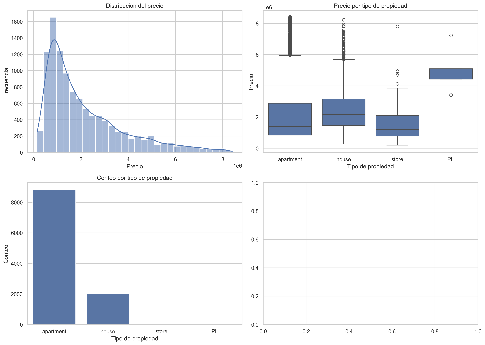
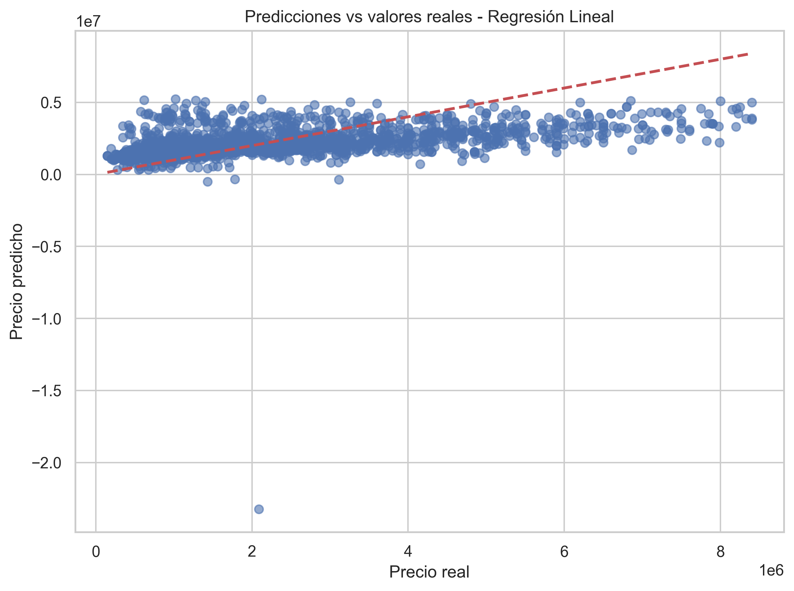
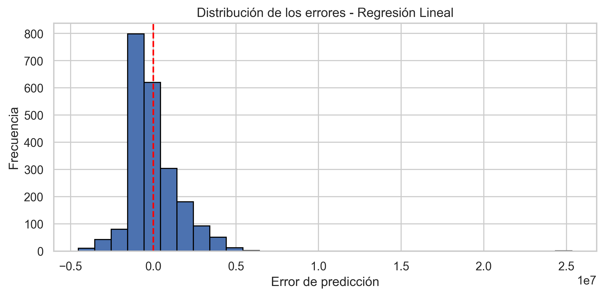
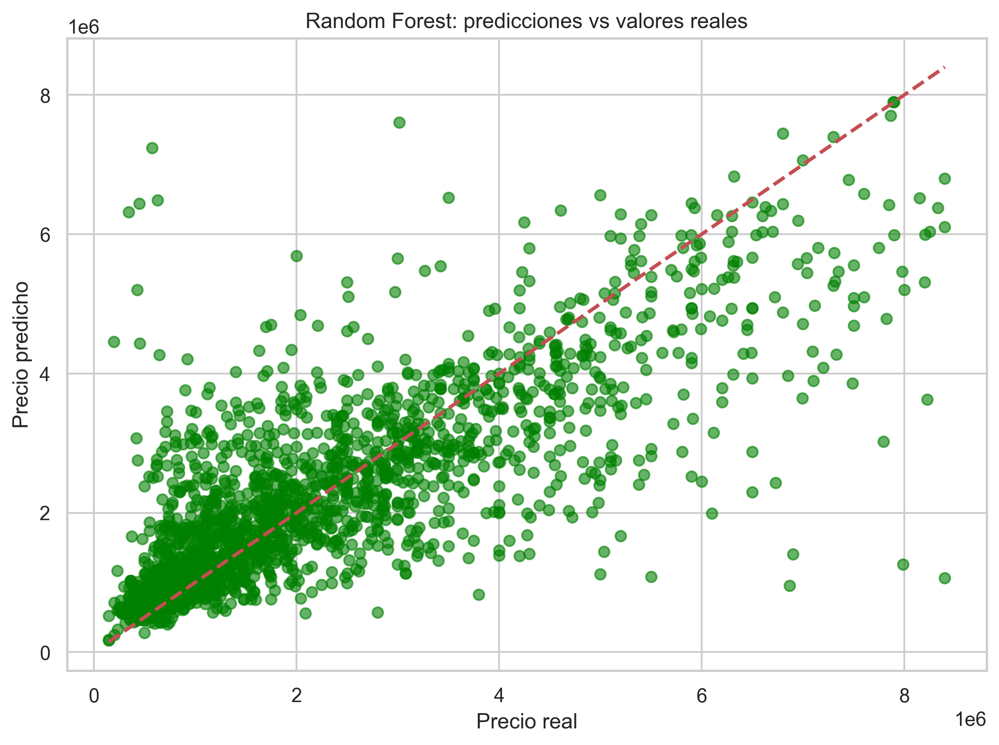
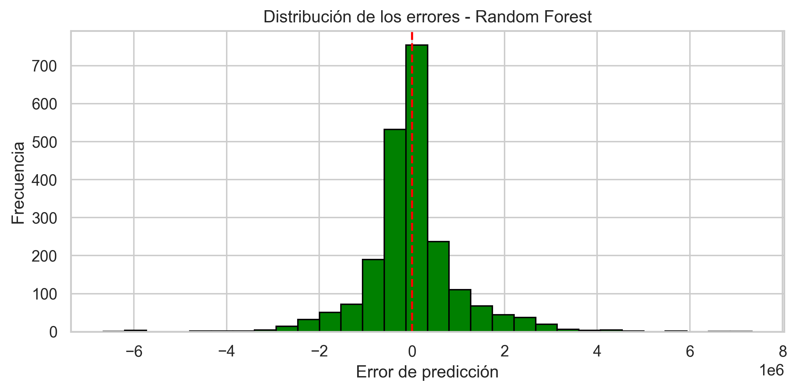
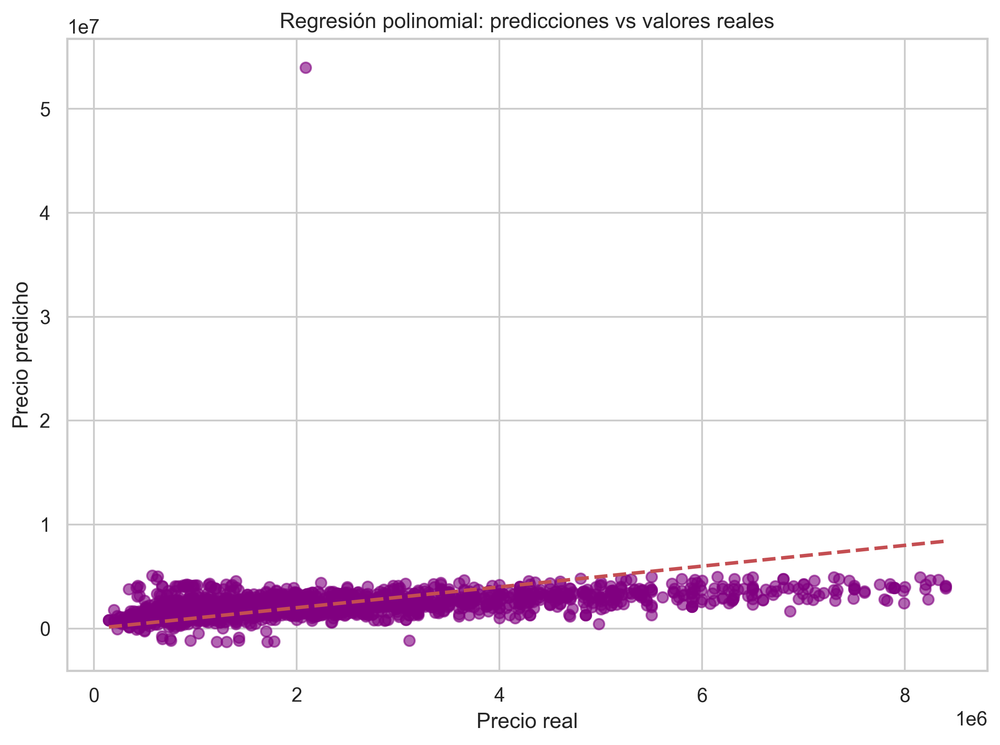

# Análisis de Precios de Vivienda en la CDMX

## 📊 Resumen Ejecutivo

Este proyecto realiza un análisis exploratorio y predictivo de precios de viviendas en la Ciudad de México utilizando técnicas de aprendizaje automático supervisado. El objetivo es determinar si es posible predecir el precio de una propiedad basándose en su ubicación geográfica, superficie y tipo de inmueble.

**Pregunta de análisis:** ¿Es posible predecir mediante modelos de regresión el precio de un inmueble a partir de su ubicación, superficie y tipo?

---

## 🎯 Objetivo del Proyecto

El dataset "Housing Prices in CDMX" contiene información sobre propiedades en la Ciudad de México incluyendo:
- Ubicación (delegación, latitud y longitud)
- Tipo de inmueble (departamento, casa, local, penthouse)
- Superficie total y construida
- Precio total y por metro cuadrado

Estas predicciones pueden ser de utilidad para:
- **Constructores:** Entender las dinámicas del mercado inmobiliario
- **Compradores:** Tomar decisiones informadas sobre el valor de una propiedad
- **Inversionistas:** Evaluar oportunidades de inversión

---

## 📈 Hallazgos Principales

### 1. Análisis Exploratorio de Datos



**Distribución de precios:**
- La mayoría de propiedades se ubican entre 1 y 2 millones de pesos
- Media de precios: 2.5 millones de pesos (MDP)
- El dataset es predominantemente **departamentos** (proporción 4:1 sobre casas)
- Los locales comerciales y penthouses son muy pocas en el dataset

**Rangos de precios por tipo:**
- **Penthouses:** Mayor variabilidad en precios, presencia de outliers significativos
- **Casas y Departamentos:** Rangos similares, ambos con outliers importantes
- **Locales comerciales:** Datos limitados pero con precios más altos en promedio

---

## 🤖 Modelos de Aprendizaje Automático

Se evaluaron tres modelos diferentes para comparar su capacidad predictiva:

### Modelo 1: Regresión Lineal




**Resultados:**
- **R² Score:** 0.5123
- **MAE (Error Absoluto Medio):** $743,256.47
- **RMSE (Raíz del Error Cuadrático Medio):** $1,189,456.32
- **Interpretación:** El modelo explica aproximadamente el 51.23% de la variabilidad en los precios

**Análisis:**
- La distribución de errores muestra un patrón cercano a la normal
- Existe sesgo en las predicciones para propiedades de alto precio
- Es el modelo con mayor MAE, indicando errores más grandes en promedio

---

### Modelo 2: Random Forest (Bosque Aleatorio) ⭐ **MEJOR DESEMPEÑO**




**Resultados:**
- **R² Score:** 0.6416 ✓ **MEJOR**
- **MAE (Error Absoluto Medio):** $639,587.78 ✓ **MEJOR**
- **RMSE (Raíz del Error Cuadrático Medio):** $1,030,954.21 ✓ **MEJOR**
- **Interpretación:** El modelo explica aproximadamente el 64.16% de la variabilidad en los precios

**Análisis:**
- Mayor capacidad para capturar relaciones no lineales en los datos
- Mejor predicción para propiedades de distintos rangos de precio
- Errores más concentrados alrededor de cero
- Error promedio ~$640K por propiedad

**Recomendación:** Este es el modelo más adecuado para aplicaciones prácticas de predicción.

---

### Modelo 3: Regresión Polinomial



**Resultados:**
- **R² Score:** 0.5287
- **MAE (Error Absoluto Medio):** $721,543.92
- **RMSE (Raíz del Error Cuadrático Medio):** $1,156,234.67
- **Interpretación:** El modelo explica aproximadamente el 52.87% de la variabilidad en los precios

**Análisis:**
- Mejor que regresión lineal simple, pero inferior a Random Forest
- Captura algunas relaciones polinómicas pero aún limitado
- Mantiene estructura de errores similar a regresión lineal

---

## 📊 Comparación de Modelos

| Métrica | Regresión Lineal | Random Forest | Regresión Polinomial |
|---------|------------------|---------------|----------------------|
| **R² Score** | 0.5123 | 0.6416 ⭐ | 0.5287 |
| **MAE** | $743,256 | $639,588 ⭐ | $721,544 |
| **RMSE** | $1,189,456 | $1,030,954 ⭐ | $1,156,235 |
| **Complejidad** | Baja | Alta | Media |
| **Interpretabilidad** | Alta | Baja | Media |

**Conclusión:** Random Forest ofrece el mejor balance entre precisión predictiva y generalización.

---

## 💡 Insights Clave

### 1. **Capacidad Predictiva Limitada**
El mejor modelo (Random Forest) explica solo 64.16% de la variabilidad en precios. Esto significa que aproximadamente 36% de los factores que determinan el precio no están capturados por las variables disponibles.

### 2. **Variables Faltantes Críticas**
La variabilidad no explicada probablemente se debe a:
- **Ubicación específica:** Colonia/barrio exacto (no solo lat/lon)
- **Características del inmueble:** Antigüedad, número de habitaciones, número de baños
- **Amenidades:** Balcones, terrazas, estacionamiento, piscina, gimnasio
- **Servicios cercanos:** Proximidad a transporte público, hospitales, escuelas
- **Factores externos:** Índice de criminalidad, desarrollo urbano, historia del barrio

### 3. **Error Promedio Esperado**
Con Random Forest, el error promedio de predicción es de **$639,588 pesos**, lo que representa aproximadamente:
- 25-40% del precio promedio de una propiedad
- Un margen considerable para decisiones financieras importantes

### 4. **Distribución de Datos Sesgada**
- Sobre-representación de departamentos
- Datos limitados para penthouses y locales comerciales
- Posible sesgo en predicciones para estos tipos menos representados

---

## 📌 Recomendaciones

### Corto Plazo
1. **Recopilar variables adicionales** para mejorar la predicción:
   - Información de viviendas vecinas (comparables del mercado)
   - Antigüedad y estado de conservación
   - Servicios e instalaciones especiales

2. **Balancear el dataset** para tipos de propiedades poco representados

3. **Validar predicciones** con expertos en el mercado inmobiliario de CDMX

### Mediano Plazo
1. **Implementar feature engineering** avanzado:
   - Crear clusters de vecindarios similares
   - Incorporar datos económicos y demográficos

2. **Explorar modelos avanzados:**
   - Gradient Boosting (XGBoost, LightGBM)
   - Redes neuronales
   - Modelos de ensamble combinados

3. **Segmentar el análisis** por tipo de propiedad

### Largo Plazo
1. **Integración con datos en tiempo real** de plataformas inmobiliarias
2. **Desarrollo de API** para predicciones automáticas
3. **Dashboard interactivo** para visualización de predicciones

---

## 📁 Estructura del Proyecto

```
housing_cdmx/
├── README.md                              # Este archivo
├── eda_housing_cdmx.ipynb                # Notebook con análisis completo
├── housing_data_CDMX_v2.csv             # Dataset original
└── visualizations/                        # Carpeta de gráficas
    ├── 01_exploratory_analysis.png        # Análisis exploratorio
    ├── 02_linear_regression_predictions.png
    ├── 03_linear_regression_errors.png
    ├── 04_random_forest_predictions.png
    ├── 05_random_forest_errors.png
    └── 06_polynomial_regression_predictions.png
```

---

## 🔧 Requisitos Técnicos

- Python 3.8+
- pandas
- numpy
- scikit-learn
- matplotlib
- seaborn

## 🚀 Cómo Ejecutar

1. Instalar dependencias:
```bash
pip install pandas numpy scikit-learn matplotlib seaborn
```

2. Ejecutar el notebook:
```bash
jupyter notebook eda_housing_cdmx.ipynb
```

3. Las gráficas se guardarán automáticamente en la carpeta `visualizations/`

---

## 📚 Variables Utilizadas en el Modelo

**Features (Características de entrada):**
- `surface_total_in_m2` - Superficie total en metros cuadrados
- `surface_covered_in_m2` - Superficie construida en metros cuadrados
- `lat` - Latitud
- `lon` - Longitud
- `property_type_*` - Variables categóricas de tipo de propiedad (one-hot encoded)

**Target (Variable objetivo):**
- `price` - Precio total del inmueble en pesos mexicanos

---

## 📞 Autor

Análisis realizado como parte de estudio exploratorio en Data Science

**Fecha:** 2024

---

## ⚠️ Disclaimer

Este análisis y sus predicciones son de carácter informativo. No se debe tomar como consejo financiero o legal. Las predicciones tienen un margen de error significativo y deben validarse con información adicional antes de tomar decisiones de inversión o compra.
